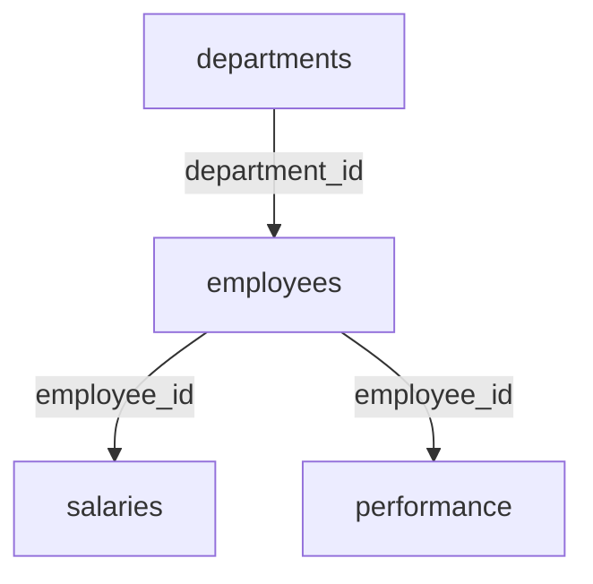

# HR Test Pack — Ground Truth & Specification

## 1. Overview & Seed Details
- **Random Seed**: Deterministic seed `101`
- **Time Span**: Hires from `2021-03-01` through `2026-03-15`. Salary effective dates from `2021-03-01` through `2026-01-01`. Performance reviews in `2024-12-15` and `2025-12-15`.
- **Deliberate Omission**: No `attrition_reason` or `termination_reason` column exists. The system must not invent reasons for departure.

## 2. Table Profiles & Row Counts

| Table Name | File Format | Row Count | Column Count | Primary Key | Foreign Keys |
| :--- | :--- | :--- | :--- | :--- | :--- |
| `departments` | CSV | 7 | 4 | `department_id` | None |
| `employees` | CSV | 50 | 7 | `employee_id` | `department_id` -> `departments.department_id` |
| `salaries` | Excel (`.xlsx`) | 133 | 5 | Composite (`employee_id`, `effective_date`) | `employee_id` -> `employees.employee_id` |
| `performance` | CSV | 81 | 5 | Composite (`employee_id`, `review_date`) | `employee_id` -> `employees.employee_id` |

### Key Columns
- **departments**: `department_id`, `department_name` (Engineering, Sales, Marketing, Finance, Operations, HR, Customer Success), `location`, `cost_center`.
- **employees**: `employee_id`, `employee_name`, `department_id`, `job_level` (L1, L2, L3, L4, L5), `location`, `hire_date`, `employment_status` (Active [38], Exited [8], On Leave [4]).
- **salaries**: `employee_id`, `effective_date`, `base_salary`, `bonus`, `salary_band` (Band-A to Band-E). Multiple historical records per employee.
- **performance**: `employee_id`, `review_date`, `performance_score` (float 2.80 to 5.00), `rating` (Exceeds Expectations, Meets Expectations, Needs Improvement), `promotion_flag` (boolean).

## 3. Relational Architecture

## 4. Calculated Ground Truth for HR QA Questions

### Question 1: How many active employees do we have?
- **Expected Answer**: **38** active employees
- **Relevant Tables**: `employees`
- **Expected Visualization Type**: `none` (or `kpi` / `scalar`)
- **Query Verification**: `SELECT COUNT(*) FROM employees WHERE employment_status = 'Active'`

### Question 2: What is the average salary by department?
*(Using latest effective salary per employee)*
- **Expected Answer**:
| department_name | avg_salary |
| :--- | :--- |
| Operations | 147028.57 |
| Engineering | 141837.5 |
| Sales | 139871.43 |
| Marketing | 135628.57 |
| HR | 135500.0 |
| Finance | 127728.57 |
| Customer Success | 126300.0 |
- **Relevant Tables**: `employees`, `departments`, `salaries`
- **Expected Visualization Type**: `bar`

### Question 3: Which department has the highest average salary?
- **Expected Answer**: **Operations** with an average salary of **$147,028.57**
- **Relevant Tables**: `employees`, `departments`, `salaries`
- **Expected Visualization Type**: `none` (or `kpi` / `bar`)

### Question 4: What is the total salary expense by department?
- **Expected Answer**:
| department_name | total_salary_expense |
| :--- | :--- |
| Engineering | 1134700.0 |
| Operations | 1029200.0 |
| Sales | 979100.0 |
| Marketing | 949400.0 |
| HR | 948500.0 |
| Finance | 894100.0 |
| Customer Success | 884100.0 |
- **Relevant Tables**: `employees`, `departments`, `salaries`
- **Expected Visualization Type**: `bar`

### Question 5: Show employee count by location.
- **Expected Answer**:
| location | employee_count |
| :--- | :--- |
| San Francisco, CA | 10 |
| Chicago, IL | 10 |
| New York, NY | 10 |
| Austin, TX | 10 |
| Remote | 10 |
- **Relevant Tables**: `employees`
- **Expected Visualization Type**: `bar`

### Question 6: Show monthly salary expense over time.
*(Aggregated total base salary effective in each recorded month)*
- **Expected Answer**:
| month | total_base_salary |
| :--- | :--- |
| 2021-03 | 65500.0 |
| 2021-04 | 94200.0 |
| 2021-05 | 89700.0 |
| 2021-06 | 87400.0 |
| 2021-07 | 122400.0 |
| 2021-08 | 121400.0 |
| 2021-09 | 119600.0 |
| 2021-11 | 158200.0 |
| 2021-12 | 162800.0 |
| 2022-01 | 211300.0 |
| 2022-02 | 64400.0 |
| 2022-03 | 89400.0 |
| 2022-05 | 86500.0 |
| 2022-06 | 91600.0 |
| 2022-07 | 129800.0 |
| 2022-08 | 123500.0 |
| 2022-09 | 123800.0 |
| 2022-10 | 156900.0 |
| 2022-11 | 165600.0 |
| 2023-01 | 266500.0 |
| 2023-03 | 86900.0 |
| 2023-04 | 87100.0 |
| 2023-05 | 86900.0 |
| 2023-07 | 254800.0 |
| 2023-08 | 125000.0 |
| 2023-10 | 161900.0 |
| 2023-11 | 168200.0 |
| 2023-12 | 204400.0 |
| 2024-01 | 62000.0 |
| 2024-02 | 94000.0 |
| 2024-03 | 93000.0 |
| 2024-05 | 91900.0 |
| 2024-06 | 128900.0 |
| 2024-07 | 120500.0 |
| 2024-08 | 128700.0 |
| 2024-09 | 171500.0 |
| 2024-10 | 171400.0 |
| 2024-12 | 288700.0 |
| 2025-01 | 5359600.0 |
| 2025-02 | 90400.0 |
| 2025-03 | 88700.0 |
| 2025-04 | 88000.0 |
| 2025-05 | 119900.0 |
| 2025-06 | 121900.0 |
| 2025-07 | 120200.0 |
| 2025-09 | 171600.0 |
| 2025-10 | 158300.0 |
| 2025-11 | 223300.0 |
| 2026-01 | 5822500.0 |
- **Relevant Tables**: `salaries`
- **Expected Visualization Type**: `line` (or `bar`)

### Question 7: What is the average salary for Engineering?
- **Expected Answer**: **$141,837.50**
- **Relevant Tables**: `employees`, `departments`, `salaries`
- **Expected Visualization Type**: `none` (or `kpi` / `scalar`)

### Question 8: How many L3 employees are there?
- **Expected Answer**: **15** employees
- **Relevant Tables**: `employees`
- **Expected Visualization Type**: `none` (or `kpi` / `scalar`)

### Question 9: What is the average performance score by department?
- **Expected Answer**:
| department_name | avg_perf_score |
| :--- | :--- |
| Sales | 4.12 |
| Engineering | 4.09 |
| Finance | 3.93 |
| HR | 3.91 |
| Operations | 3.81 |
| Customer Success | 3.77 |
| Marketing | 3.68 |
- **Relevant Tables**: `employees`, `departments`, `performance`
- **Expected Visualization Type**: `bar`

### Question 10: Which department has the highest average performance score?
- **Expected Answer**: **Sales** with an average score of **4.12**
- **Relevant Tables**: `employees`, `departments`, `performance`
- **Expected Visualization Type**: `none` (or `kpi` / `bar`)

### Question 11: Show the relationship between job level and average salary.
- **Expected Answer**:
| job_level | avg_salary |
| :--- | :--- |
| L1 | 70020.0 |
| L2 | 97840.0 |
| L3 | 135700.0 |
| L4 | 180260.0 |
| L5 | 232660.0 |
- **Relevant Tables**: `employees`, `salaries`
- **Expected Visualization Type**: `bar` (or `scatter`)

### Question 12: What was the average salary in 2025?
- **Expected Answer**: **$130,838.00** (salaries effective in calendar year 2025)
- **Relevant Tables**: `salaries`
- **Expected Visualization Type**: `none` (or `kpi` / `scalar`)

### Question 13: What about 2026?
- **Expected Answer**: **$138,630.95** (salaries effective in calendar year 2026)
- **Relevant Tables**: `salaries`
- **Expected Visualization Type**: `none` (or `kpi` / `scalar`)

### Question 14: What is the average salary of active Engineering employees?
- **Expected Answer**: **$135,250.00**
- **Relevant Tables**: `employees`, `departments`, `salaries`
- **Expected Visualization Type**: `none` (or `kpi` / `scalar`)

### Question 15: What about L3 Engineering employees?
- **Expected Answer**: **$139,300.00**
- **Relevant Tables**: `employees`, `departments`, `salaries`
- **Expected Visualization Type**: `none` (or `kpi` / `scalar`)

### Question 16: Show salary trends for Engineering.
- **Expected Answer**:
| effective_date | avg_base_salary |
| :--- | :--- |
| 2021-03-01 | 65500.0 |
| 2021-11-07 | 158200.0 |
| 2022-07-16 | 129800.0 |
| 2023-03-09 | 86900.0 |
| 2023-11-15 | 168200.0 |
| 2024-07-08 | 120500.0 |
| 2025-01-01 | 128800.0 |
| 2025-03-16 | 88700.0 |
| 2025-11-22 | 223300.0 |
| 2026-01-01 | 149428.57 |
- **Relevant Tables**: `employees`, `departments`, `salaries`
- **Expected Visualization Type**: `line`

### Question 17: Which department has the largest number of exited employees?
- **Expected Answer**: **Finance** (2 exited employees)
- **Breakdown**:
| department_name | exited_count |
| :--- | :--- |
| Finance | 2 |
| Customer Success | 1 |
| Engineering | 1 |
| HR | 1 |
| Marketing | 1 |
| Operations | 1 |
| Sales | 1 |
- **Relevant Tables**: `employees`, `departments`
- **Expected Visualization Type**: `bar` (or `scalar`)

### Question 18: What was the average salary before the most recent salary change?
- **Expected Answer**: **$133,453.33** (computed from the 2nd most recent salary record per employee)
- **Relevant Tables**: `salaries`
- **Expected Visualization Type**: `none` (or `kpi` / `scalar`)

---

## 5. Conversational Follow-Up Sequence Test

The system must support the following consecutive multi-turn dialogue with state preservation:

1. **User**: *"What is the average salary by department?"*
   - **State Updated**: `metric="salary"`, `grouping="department"`.
   - **Result**: Department breakdown table / bar chart (Q2).
2. **User**: *"What about Engineering?"*
   - **State Updated**: Preserves metric `salary`, adds filter `department="Engineering"`.
   - **Result**: Scalar value **$141,837.50** (Q7).
3. **User**: *"What about L3?"*
   - **State Updated**: Preserves `salary`, `department="Engineering"`, adds filter `job_level="L3"`.
   - **Result**: Scalar value **$139,300.00** (Q15).
4. **User**: *"Show that over time."*
   - **State Updated**: Preserves `salary`, `department="Engineering"`, `job_level="L3"`, changes grouping to `effective_date` / time.
   - **Result**: Time series line chart:
| effective_date | avg_salary |
| :--- | :--- |
| 2022-07-16 | 129800.0 |
| 2024-07-08 | 120500.0 |
| 2025-01-01 | 132650.0 |
| 2026-01-01 | 139300.0 |

---

## 6. Expected Behavior for Negative / Missing-Data Questions

The datasets intentionally do NOT contain attrition reasons, employee satisfaction surveys, or attendance / leave records. The application MUST return `cannot_answer` without hallucinating:

| Question Number | Question Text | Missing Information | Expected System Behavior |
| :--- | :--- | :--- | :--- |
| **Q19** | *Why did employees leave?* | No `attrition_reason` or exit survey column exists in `employees` or `departments`. | Inform user that reason for departure is not tracked in the dataset. |
| **Q20** | *What are the most common resignation reasons?* | No resignation categories or exit feedback columns exist. | Decline with message stating resignation reasons are not present. |
| **Q21** | *What is employee satisfaction?* | No pulse survey, eNPS, or satisfaction score fields exist. | Decline with notice that satisfaction scores are not available. |
| **Q22** | *What is the average number of sick days?* | No time-off, PTO, or sick leave records exist. | Decline with notice that sick days and leave metrics are not recorded. |
