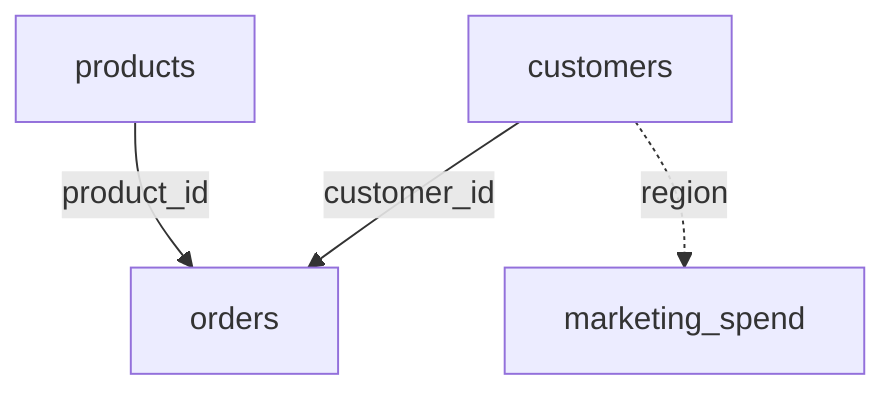

# Retail Test Pack — Ground Truth & Specification

## 1. Overview & Seed Details
- **Random Seed**: Deterministic seed `42`
- **Time Span**: Orders from `2025-01-03` to `2026-09-15` (covering 21 months, 7 quarters across 2025 and 2026).
- **Temporal Anchors**:
  - `current year`: 2026 (`2026-01-01` to `2026-09-15`)
  - `previous year`: 2025 (`2025-01-01` to `2025-12-31`)
  - `last quarter`: Q2 2026 (`2026-04-01` to `2026-06-30`, given max date in Q3 2026)

## 2. Table Profiles & Row Counts

| Table Name | File Format | Row Count | Column Count | Primary Key | Foreign Keys |
| :--- | :--- | :--- | :--- | :--- | :--- |
| `customers` | CSV | 60 | 5 | `customer_id` | None |
| `orders` | CSV | 500 | 9 | `order_id` | `customer_id` -> `customers.customer_id` `product_id` -> `products.product_id` |
| `products` | CSV | 25 | 5 | `product_id` | None |
| `marketing_spend` | CSV | 336 | 4 | Composite (`month`, `region`, `channel`) | `region` matches `customers.region` `month` matches `orders.order_date` (`YYYY-MM`) |

### Key Columns
- **customers**: `customer_id`, `customer_name`, `segment` (Consumer, Small Business, Enterprise), `region` (North, South, East, West), `signup_date`.
- **orders**: `order_id`, `customer_id`, `product_id`, `order_date`, `status` (completed [400], cancelled [60], pending [40]), `quantity`, `unit_price`, `discount`, `line_total`.
  - Mathematical integrity: `line_total = round(quantity * unit_price * (1 - discount), 2)`
- **products**: `product_id`, `product_name`, `category` (Hardware, Software, Accessories, Services), `subcategory`, `unit_cost`.
- **marketing_spend**: `month` (YYYY-MM), `region`, `channel` (Search, Social, Email, Events), `spend`.

## 3. Relational Architecture

## 4. Calculated Ground Truth for Retail QA Questions

### Question 1: What is the total revenue?
- **Expected Answer**: **$2,215,867.75**
- **Relevant Tables**: `orders`
- **Expected Visualization Type**: `none` (or `kpi` / `scalar`)
- **Query Verification**: `SELECT ROUND(SUM(line_total), 2) FROM orders`

### Question 2: What is the average order value for completed orders?
- **Expected Answer**: **$4,216.07**
- **Relevant Tables**: `orders`
- **Expected Visualization Type**: `none` (or `kpi` / `scalar`)
- **Query Verification**: `SELECT ROUND(AVG(line_total), 2) FROM orders WHERE status = 'completed'`

### Question 3: What is the total revenue from the South region?
- **Expected Answer**: **$740,684.00**
- **Relevant Tables**: `orders`, `customers`
- **Expected Visualization Type**: `none` (or `kpi` / `scalar`)
- **Query Verification**: `SELECT ROUND(SUM(o.line_total), 2) FROM orders o JOIN customers c ON o.customer_id = c.customer_id WHERE c.region = 'South'`

### Question 4: Compare revenue across regions.
- **Expected Answer**:
| region | revenue |
| :--- | :--- |
| South | 740684.0 |
| East | 592094.0 |
| North | 448398.75 |
| West | 434691.0 |
- **Relevant Tables**: `orders`, `customers`
- **Expected Visualization Type**: `bar`

### Question 5: Which region generated the most revenue?
- **Expected Answer**: **South** with **$740,684.00**
- **Relevant Tables**: `orders`, `customers`
- **Expected Visualization Type**: `none` (or `kpi` / `bar`)

### Question 6: Show monthly revenue over time.
- **Expected Answer**:
| month | revenue |
| :--- | :--- |
| 2025-01 | 69911.25 |
| 2025-02 | 121038.75 |
| 2025-03 | 64219.25 |
| 2025-04 | 87405.0 |
| 2025-05 | 94662.25 |
| 2025-06 | 73507.5 |
| 2025-07 | 103418.5 |
| 2025-08 | 139012.5 |
| 2025-09 | 114800.25 |
| 2025-10 | 82640.5 |
| 2025-11 | 98363.0 |
| 2025-12 | 83300.25 |
| 2026-01 | 190151.5 |
| 2026-02 | 94795.75 |
| 2026-03 | 94639.5 |
| 2026-04 | 72298.0 |
| 2026-05 | 229700.25 |
| 2026-06 | 152811.5 |
| 2026-07 | 45217.25 |
| 2026-08 | 145795.0 |
| 2026-09 | 58180.0 |
- **Relevant Tables**: `orders`
- **Expected Visualization Type**: `line`

### Question 7: What is the total revenue by customer segment?
- **Expected Answer**:
| segment | revenue |
| :--- | :--- |
| Enterprise | 1476898.0 |
| Small Business | 484654.75 |
| Consumer | 254315.0 |
- **Relevant Tables**: `orders`, `customers`
- **Expected Visualization Type**: `bar`

### Question 8: Which product category generated the most revenue?
- **Expected Answer**: **Services** with **$1,488,830.00**
- **Breakdown**:
| category | line_total |
| :--- | :--- |
| Services | 1488830.0 |
| Hardware | 401936.0 |
| Software | 254660.0 |
| Accessories | 70441.75 |
- **Relevant Tables**: `orders`, `products`
- **Expected Visualization Type**: `bar`

### Question 9: Which customer segment generated the most revenue from Hardware products?
- **Expected Answer**: **Enterprise** with **$232,675.50**
- **Breakdown**:
| segment | line_total |
| :--- | :--- |
| Enterprise | 232675.5 |
| Small Business | 117933.0 |
| Consumer | 51327.5 |
- **Relevant Tables**: `orders`, `customers`, `products`
- **Expected Visualization Type**: `bar`

### Question 10: What is the total revenue from Hardware products in the last quarter?
- **Expected Answer**: **$68,574.00** (Q2 2026: 2026-04-01 to 2026-06-30)
- **Relevant Tables**: `orders`, `products`
- **Expected Visualization Type**: `none` (or `kpi` / `scalar`)

### Question 11: Show revenue by product category for the South region.
- **Expected Answer**:
| category | south_revenue |
| :--- | :--- |
| Services | 507600.0 |
| Hardware | 150826.5 |
| Software | 62300.0 |
| Accessories | 19957.5 |
- **Relevant Tables**: `orders`, `customers`, `products`
- **Expected Visualization Type**: `bar`

### Question 12: Which customer spent the most?
- **Expected Answer**: **Sandra Robinson** (CUST-1030) with total spend of **$128,270.50**
- **Relevant Tables**: `orders`, `customers`
- **Expected Visualization Type**: `none` (or `kpi` / `scalar`)

### Question 13: Show the top 10 customers by revenue.
- **Expected Answer**:
| customer_name | customer_id | segment | region | total_revenue |
| :--- | :--- | :--- | :--- | :--- |
| Sandra Robinson | CUST-1030 | Enterprise | South | 128270.5 |
| Joshua Hill | CUST-1039 | Enterprise | North | 115990.5 |
| Sharon Turner | CUST-1054 | Enterprise | South | 113774.0 |
| David Rodriguez | CUST-1009 | Enterprise | East | 102298.0 |
| Sarah Moore | CUST-1018 | Enterprise | South | 94880.0 |
| Jennifer Garcia | CUST-1006 | Enterprise | South | 89669.5 |
| Carol Adams | CUST-1042 | Enterprise | South | 85419.75 |
| Steven Allen | CUST-1033 | Enterprise | East | 84644.25 |
| Jeffrey Cruz | CUST-1057 | Enterprise | East | 84517.75 |
| Lisa White | CUST-1024 | Enterprise | West | 82618.5 |
- **Relevant Tables**: `orders`, `customers`
- **Expected Visualization Type**: `bar` (or `table`)

### Question 14: Compare revenue with marketing spend by region.
- **Expected Answer**:
| region | total_revenue | total_marketing_spend |
| :--- | :--- | :--- |
| South | 740684.0 | 321833.72 |
| East | 592094.0 | 352871.01 |
| North | 448398.75 | 386260.47 |
| West | 434691.0 | 369092.13 |
- **Relevant Tables**: `orders`, `customers`, `marketing_spend`
- **Expected Visualization Type**: `bar` (grouped or table)

### Question 15: Show monthly revenue and monthly marketing spend.
- **Expected Answer**:
| month | revenue | marketing_spend |
| :--- | :--- | :--- |
| 2025-01 | 69911.25 | 69538.98 |
| 2025-02 | 121038.75 | 64221.29 |
| 2025-03 | 64219.25 | 66922.15 |
| 2025-04 | 87405.0 | 68012.64 |
| 2025-05 | 94662.25 | 67668.6 |
| 2025-06 | 73507.5 | 69007.76 |
| 2025-07 | 103418.5 | 67763.42 |
| 2025-08 | 139012.5 | 70034.97 |
| 2025-09 | 114800.25 | 67500.87 |
| 2025-10 | 82640.5 | 66910.17 |
| 2025-11 | 98363.0 | 67243.66 |
| 2025-12 | 83300.25 | 68810.99 |
| 2026-01 | 190151.5 | 66967.07 |
| 2026-02 | 94795.75 | 66908.57 |
| 2026-03 | 94639.5 | 67176.68 |
| 2026-04 | 72298.0 | 71796.75 |
| 2026-05 | 229700.25 | 69893.8 |
| 2026-06 | 152811.5 | 67099.49 |
| 2026-07 | 45217.25 | 67626.76 |
| 2026-08 | 145795.0 | 70014.82 |
| 2026-09 | 58180.0 | 68937.89 |
- **Relevant Tables**: `orders`, `marketing_spend`
- **Expected Visualization Type**: `line` (or `bar` / `table`)

### Question 16: What was revenue in the previous year?
- **Expected Answer**: **$1,132,279.00** (Year 2025: 2025-01-01 to 2025-12-31)
- **Relevant Tables**: `orders`
- **Expected Visualization Type**: `none` (or `kpi` / `scalar`)

### Question 17: What is the average order value for completed Hardware orders in the South?
- **Expected Answer**: **$3,421.95**
- **Relevant Tables**: `orders`, `customers`, `products`
- **Expected Visualization Type**: `none` (or `kpi` / `scalar`)

### Question 18: What about North?
- **Expected Answer**: **$3,726.31**
- **Relevant Tables**: `orders`, `customers`, `products`
- **Expected Visualization Type**: `none` (or `kpi` / `scalar`)

### Question 19: Compare South and North revenue.
- **Expected Answer**:
| region | revenue |
| :--- | :--- |
| South | 740684.0 |
| North | 448398.75 |
- **Relevant Tables**: `orders`, `customers`
- **Expected Visualization Type**: `bar`

### Question 20: Show that comparison by month.
- **Expected Answer**:
| month | region | revenue |
| :--- | :--- | :--- |
| 2025-01 | North | 30987.5 |
| 2025-01 | South | 22323.75 |
| 2025-02 | North | 6308.5 |
| 2025-02 | South | 34170.5 |
| 2025-03 | North | 12944.0 |
| 2025-03 | South | 30707.25 |
| 2025-04 | North | 12135.0 |
| 2025-04 | South | 43158.5 |
| 2025-05 | North | 22223.5 |
| 2025-05 | South | 16398.0 |
| 2025-06 | North | 22126.5 |
| 2025-06 | South | 36873.5 |
| 2025-07 | North | 16360.0 |
| 2025-07 | South | 9717.0 |
| 2025-08 | North | 19703.5 |
| 2025-08 | South | 51083.0 |
| 2025-09 | North | 24750.0 |
| 2025-09 | South | 63903.5 |
| 2025-10 | North | 16211.0 |
| 2025-10 | South | 8867.0 |
| 2025-11 | North | 25025.0 |
| 2025-11 | South | 12582.5 |
| 2025-12 | North | 17372.5 |
| 2025-12 | South | 38196.75 |
| 2026-01 | North | 17158.5 |
| 2026-01 | South | 88038.0 |
| 2026-02 | North | 56143.0 |
| 2026-02 | South | 27217.0 |
| 2026-03 | North | 54648.5 |
| 2026-03 | South | 14708.25 |
| 2026-04 | North | 18354.25 |
| 2026-04 | South | 10903.0 |
| 2026-05 | North | 16520.5 |
| 2026-05 | South | 88555.0 |
| 2026-06 | North | 10515.0 |
| 2026-06 | South | 77932.5 |
| 2026-07 | North | 617.5 |
| 2026-07 | South | 13090.5 |
| 2026-08 | North | 17125.0 |
| 2026-08 | South | 27464.5 |
| 2026-09 | North | 31169.5 |
| 2026-09 | South | 24794.0 |
- **Relevant Tables**: `orders`, `customers`
- **Expected Visualization Type**: `line` (or `bar`)

---

## 5. Expected Behavior for Negative / Missing-Data Questions

The following questions MUST NOT be answered with fabricated data. The model must return `status="cannot_answer"` with a clear explanation of missing columns/data:

| Question Number | Question Text | Missing Information | Expected System Behavior |
| :--- | :--- | :--- | :--- |
| **Q21** | *What is our employee attrition rate?* | No employee or HR tables present in the retail dataset. | Decline and inform user that employee data is not present in the uploaded tables. |
| **Q22** | *What was our profit margin?* | Profit margin requires total cost of goods sold or operating expenses subtracted from net revenue; while `products.unit_cost` exists, operating overhead expenses are absent. | Clarify or decline if interpreted as corporate profit margin, or explicitly state assumptions. |
| **Q23** | *How many employees resigned?* | No employee or HR tables present. | Decline with clear notice of missing data. |
| **Q24** | *What was the customer satisfaction score?* | No CSAT, NPS, survey, or feedback ratings exist in `customers` or `orders`. | Decline and state that customer satisfaction scores are not tracked in the dataset. |
